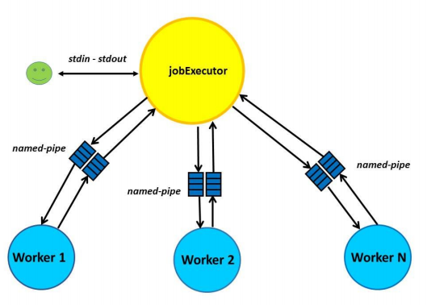

# JobExecutor
Utilizing [MiniSearch](https://github.com/taggelos/MiniSearch) repository, using named pipes and signals.

<b><i> Arguments: </i></b>  
./minisearch -i docfile -k K   
./minisearch -i docfile (default value 10 gia to K)   
./minisearch -k K -i docfile   

<b><i> Commands: </i></b>  
<b>/search q1, q2 .. q10 –d deadline</b> (search 1 to 10 words and receive results inside the deadline period)  
<b>/maxcount q1</b>                   {find the document with the highest frequency of the q1 (alphabetical order if 2 or more are the same)}  
<b>/mincount q1</b>                {find the document with the lowest frequency of the q1 (at least one time)}  
<b>/wc</b>                   (total number of bytes, words and lines from every file)  

In the log folder that is automatically created we hold logs from each individual process (workers)

The architecture can be seen in the image below

